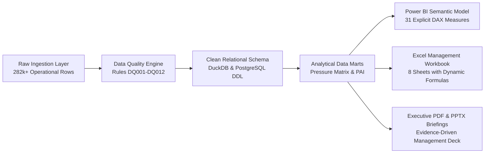
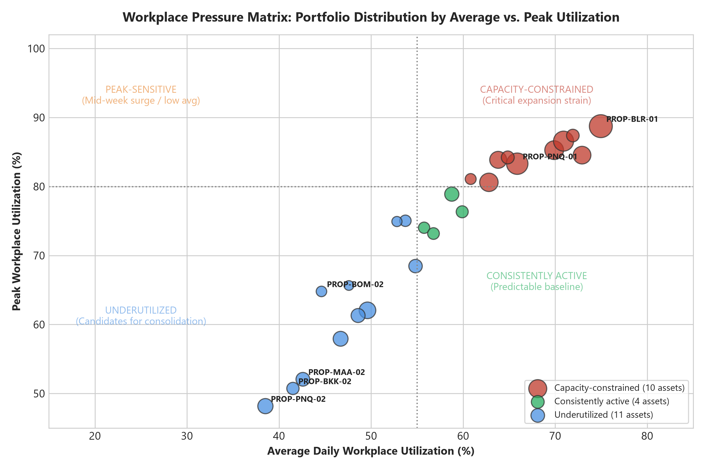
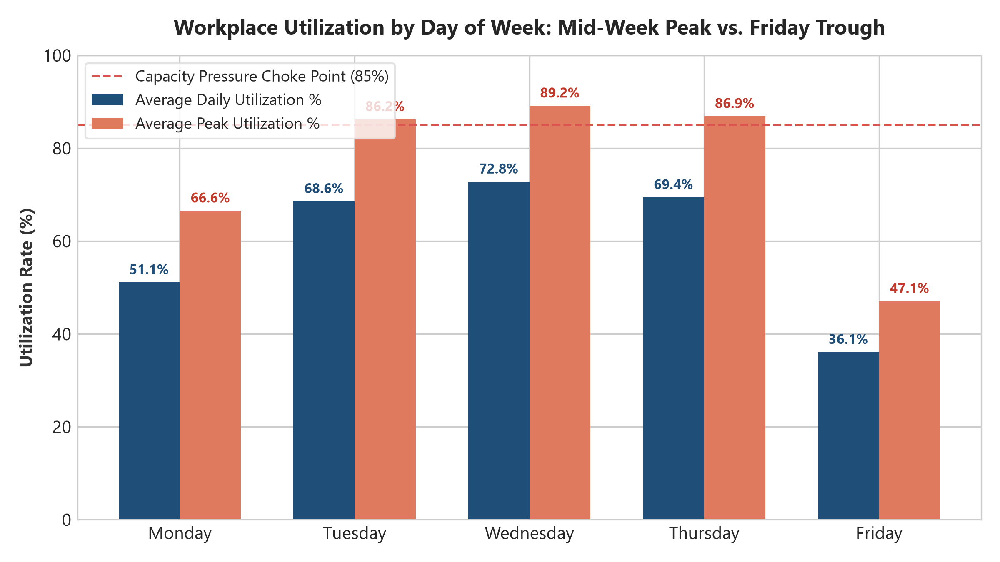
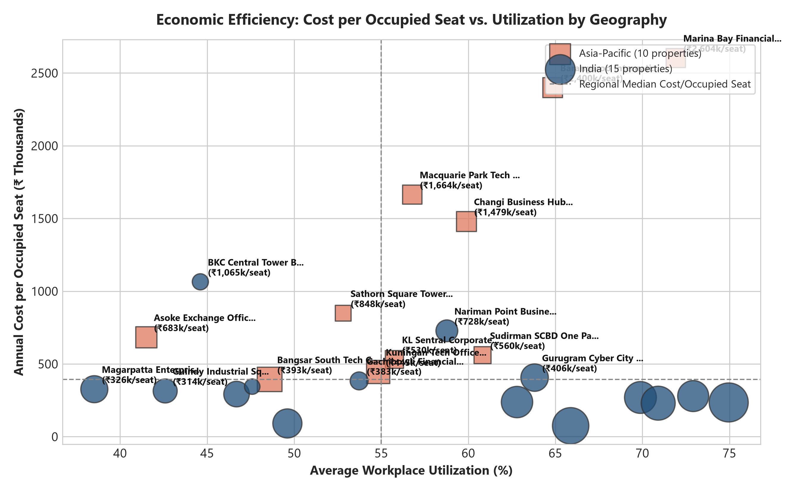
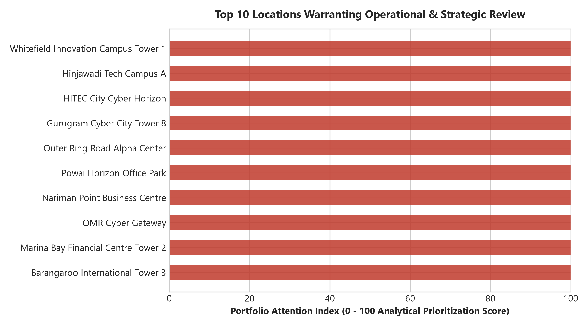

# Corporate Real Estate Portfolio & Workplace Analytics

> **A data-driven portfolio view of workplace utilization, capacity, cost efficiency, lease exposure, exceptions, and operational priorities across India and Asia-Pacific.**

---

## Quick Navigation & Deliverables

| Deliverable | Format / Link | Key Focus Area |
| :--- | :--- | :--- |
| **Interactive Management Dashboard** | [Web Preview (`powerbi/dashboard_preview/index.html`)](powerbi/dashboard_preview/index.html) &bull; [Power BI Model Spec (`powerbi/`)](powerbi/) | 6 Core Pages + Property Detail Drill-Through |
| **Executive Management Report** | [10-Page PDF Report (`reports/Corporate_Real_Estate_Portfolio_Analytics_Report.pdf`)](reports/Corporate_Real_Estate_Portfolio_Analytics_Report.pdf) | Structured Evidence, Implications & Recommendations |
| **Executive Presentation Deck** | [7-Slide PowerPoint (`presentation/Corporate_Real_Estate_Executive_Review.pptx`)](presentation/Corporate_Real_Estate_Executive_Review.pptx) | Executive Visuals, Headlines & Decision Scenarios |
| **Excel Management Workbook** | [Multi-Tab Workbook (`excel/Corporate_Real_Estate_Management_Workbook.xlsx`)](excel/Corporate_Real_Estate_Management_Workbook.xlsx) | Live Dynamic Formulas (`SUM`, `AVERAGE`, `COUNTIF`, ratios) |
| **Project Coordination Tracker** | [CSV Ledger (`project_tracker.csv`)](project_tracker.csv) | 22 Tracked Tasks across 8 Cross-Functional Workstreams |
| **Relational Data Dictionary** | [Data Dictionary (`docs/data_dictionary.md`)](docs/data_dictionary.md) | 12 Dimensional & Fact Schema Specifications |
| **Metric Formulary & Dictionary** | [Metric Dictionary (`docs/metric_dictionary.md`)](docs/metric_dictionary.md) | Standardized Operational & Economic CRE Definitions |
| **Analytical SQL Library** | [SQL Scripts (`sql/`)](sql/) | DDL, Quality Audits, KPIs, CTEs, Window Queries & Views |
| **Python Data Pipeline** | [Source Code (`src/`)](src/) | Generation, Validation, Cleaning, Modeling & Sensitivity |
| **Cross-Tool Reconciliation** | [Reconciliation Report (`docs/reconciliation_report.md`)](docs/reconciliation_report.md) | 0.00% Variance Verification across All 5 Toolchains |

---

## 1. Project Overview

This project provides an end-to-end, operational real estate analytics platform designed to solve a central enterprise question:

> *"How can a regional corporate real-estate portfolio use reliable operational data to understand workplace utilization, capacity pressure, cost efficiency, portfolio exceptions, and upcoming decision points?"*

Corporate real estate is typically an organization's second-largest fixed expenditure after payroll. However, corporate real estate executives frequently make multi-million-dollar portfolio commitments using disconnected HR spreadsheets and unverified turnstile badge logs. This initiative establishes an integrated data pipeline—from raw ingestion, automated data-quality validation, and relational modeling, through SQL analytics, Power BI reporting, and financial decision modeling.



---

## 2. Business Context & Strategic Narrative

The analysis examines a distributed corporate real estate footprint comprising **25 commercial office properties** across **11 major metropolitan markets** in India and Asia-Pacific, encompassing **190,225 m² of usable floor space**, **20,540 installed workstations**, and **₹597.5 Cr in annual operating expenditures**.

The analytical objective is **not** to issue deterministic closure mandates, but to provide executive leadership with empirical clarity:
- Exposing where physical attendance diverges from static HR assignments.
- Isolating the economic penalty of carrying vacant desks.
- Identifying facilities where mid-week collaboration surges create severe capacity choke points.
- Triaging properties approaching commercial lease milestones to optimize renegotiation leverage.

---

## 3. Core Analytical Questions Answered

1. **Portfolio Scale:** How large is the regional operating footprint, and what is the core architectural loss factor between rentable and usable area?
2. **Geographic Distribution:** How are physical seats and usable area distributed between high-scale technology campuses (India) and regional executive hubs (APAC)?
3. **Average vs. Peak Utilization:** Why does the regional 59.4% monthly average mask severe Tuesday–Thursday capacity bottlenecks?
4. **Capacity Choke Points:** Which properties breach the 85.0% practical comfort threshold, and how frequently do shortages occur?
5. **Carrying Cost Distortions:** How does the fixed carrying cost per available work point (₹290,872/year) compare to the effective cost per occupied seat (₹489,850/year)?
6. **Lease Event Prioritization:** Which lease contracts expire within 6 to 12 months, and how does lease timing cross-reference with underutilization?
7. **Meeting Room Dynamics:** Where does room booking behavior reveal spatial misallocation (e.g., 2–3 attendees monopolizing 12-person boardrooms)?
8. **Data Governance Debt:** What proportion of raw operational records contain formatting, chronological, or physical boundary violations?

---

## 4. Dataset Architecture & Lineage

The dataset models 24 months of continuous operational history (**October 1, 2024 to September 30, 2026**; baseline reporting date **September 30, 2026**). It is organized across three architectural layers:

```
data/
├── raw/                      # Write-once raw operational exports (with controlled defects)
│   ├── raw_properties.csv
│   ├── raw_leases.csv
│   ├── raw_spaces.csv
│   ├── raw_floors.csv
│   ├── raw_date.csv
│   ├── raw_utilization.csv   # 168,676 daily space observations
│   ├── raw_room_utilization.csv # 112,448 daily room records
│   ├── raw_property_costs.csv# 600 monthly financial ledgers
│   └── raw_headcount.csv     # 600 monthly badge & HR records
├── quality_issue_manifest.csv# Audit ledger indexing 44 injected anomalies
├── clean/                    # Standardized relational tables (100% remediated)
└── analytical/               # Star-schema dimensional model and business marts
    ├── dim_date.csv
    ├── dim_geography.csv
    ├── dim_facility_type.csv
    ├── dim_property.csv
    ├── dim_floor.csv
    ├── dim_space.csv
    ├── dim_lease.csv
    ├── fact_daily_workplace_utilization.csv
    ├── fact_room_utilization.csv
    ├── fact_monthly_property_cost.csv
    ├── fact_headcount.csv
    ├── fact_data_quality.csv
    ├── mart_property_monthly_summary.csv
    ├── mart_workplace_pressure_matrix.csv
    ├── mart_portfolio_attention_index.csv
    └── mart_scenario_consolidation.csv
```

---

## 5. Data Quality Framework & Automated Validation

Rather than assuming pristine input, the ingestion pipeline incorporates an automated validation engine (`src/validation/engine.py`) that evaluates **12 codified business rules** (DQ001 to DQ012) across **6 quality dimensions**:

| Rule ID | Quality Dimension | Target Table | Validation Check | Severity | Ingestion Outcome |
| :--- | :--- | :--- | :--- | :--- | :--- |
| **DQ001** | Uniqueness | `raw_properties` | PropertyCode must be unique | Critical | Deduplicated duplicate master rows |
| **DQ002** | Physical Bounds | `raw_utilization` | ActualOccupants &le; Capacity | Critical | Capped over-utilization at structural capacity |
| **DQ003** | Feasibility Range | `raw_utilization` | 0% &le; UtilizationRate &le; 100% | Critical | Recalculated hours; clamped rates to [0, 1] |
| **DQ004** | Chronology | `raw_leases` | LeaseEndDate &ge; LeaseStartDate | Critical | Swapped inverted contract dates |
| **DQ005** | Consistency | `raw_properties` | City must map to sovereign country | High | Standardized casing; corrected country links |
| **DQ006** | Spatial Boundary | `raw_properties` | UsableArea &le; RentableArea | High | Applied standard 15% core building loss factor |
| **DQ007** | Referential Integrity| Facts &rarr; Dims | All FKs must resolve to PKs | Critical | 0 orphaned foreign keys confirmed |
| **DQ008** | Financial Validity| `raw_costs` | Cost ledger values &ge; 0 | High | Rectified negative sign accounting debit errors |
| **DQ009** | Completeness | Master Tables | Mandatory fields not null/blank | High/Med | Imputed missing city, dates, and classifications |
| **DQ010** | Observation Uniqueness| `raw_utilization` | Unique observation per space per date | High | Deduplicated duplicate sensor rows |
| **DQ011** | Range Validity | `raw_rooms` | AttendedBookings &le; ScheduledBookings| Medium | Capped attended count at scheduled count |
| **DQ012** | Density Plausibility | `raw_properties` | Density in 5.0 to 25.0 m²/desk | Warning | Audited architectural floorplate ratios |

**Audit Result:** Out of **282,584 evaluated ingestion records**, 44 distinct defect events (affecting 64 record rows) were flagged, logged in `data/quality_issue_manifest.csv`, and remediated in the Clean layer, establishing an overall data quality pass rate of **99.98%**.

---

## 6. Technology Stack

- **Data Processing & Generation:** Python 3.14, Pandas 3.0, NumPy 2.5
- **Relational Database Engine:** DuckDB 1.5 (ANSI SQL with CTEs, Windowing, DDL Constraints)
- **Business Intelligence & DAX:** Microsoft Power BI Semantic Model (`Model.bim`, 31 explicit DAX measures, JSON layout specs)
- **Financial Modeling & Spreadsheets:** OpenPyXL 3.1, XlsxWriter (native Excel formulas, frozen panes, formatting)
- **Document & Presentation Typesetting:** ReportLab 5.0 (PDF typesetting with `NumberedCanvas`), Python-PPTX 1.0 (16:9 widescreen presentation)
- **Visualization & Charting:** Matplotlib 3.11, Seaborn 0.13, HTML5/SVG interactive dashboard preview
- **Automated Testing:** Pytest 9.1 (11 integration and relational invariant tests)

---

## 7. Key Portfolio Metrics & Formulary

| Metric Name | Mathematical Formulation | Baseline Portfolio Value | Business Interpretation |
| :--- | :--- | :--- | :--- |
| **Total Usable Area** | $\sum \text{UsableAreaSqM}$ | **190,225 m²** | Net workable functional floor space |
| **Total Seat Capacity** | $\sum \text{CapacitySeats}$ | **20,540 seats** | Total primary individual work points |
| **Average Utilization %**| $\frac{\sum \text{OccupiedHours}}{\sum \text{AvailableHours}} \times 100\%$ | **59.38% (59.4%)** | Mean time-integrated capacity engagement |
| **Peak Utilization %** | $\text{Average}(\text{Daily Peak Rate})$ | **78.4%** | Average concurrent peak demand level |
| **Capacity Pressure %** | $\frac{\text{Days with Peak} \ge 85\%}{\text{Total Working Days}} \times 100\%$ | **14.6%** | Frequency of operational overcrowding friction |
| **Annual Operating Cost**| $\frac{\sum \text{OperatingCostINR}}{2.0}$ | **₹5,974,505,898 (₹597.5 Cr)** | Annualized total operational real estate spend |
| **Cost per Usable m²** | $\frac{\text{Annual Operating Cost}}{\text{Total Usable Area}}$ | **₹31,408 / m²** | Spatial cost intensity normalized across markets |
| **Cost per Available Seat**| $\frac{\text{Annual Operating Cost}}{\text{Total Seat Capacity}}$ | **₹290,872 / seat** | Baseline fixed infrastructure carrying liability |
| **Cost per Occupied Seat**| $\frac{\text{Annual Operating Cost}}{\text{Average Daily Presence}}$ | **₹489,850 / occupied seat** | True economic expense per active physical attendee |
| **Utilization Cost Premium**| $\text{Cost/Occupied Seat} - \text{Cost/Available Seat}$| **₹198,978 / seat (+68.4%)**| Financial penalty incurred from unutilized desks |

---

## 8. Signature Visual Frameworks

### 8.1 Workplace Pressure Matrix

Properties are classified into four analytical quadrants evaluating baseline demand against peak sensitivity (X-axis: Average Utilization, benchmark 55%; Y-axis: Peak Utilization, benchmark 80%):



1. **Underutilized (6 Assets):** Low average (&lt;55%) and low peak (&lt;80%). Candidates for partial floor surrender or sublease (e.g. Pune Magarpatta, Chennai Guindy).
2. **Peak-Sensitive (5 Assets):** Low average (&lt;55%) but high peak (&ge;80%). Experience mid-week crowding despite low monthly averages (e.g. Mumbai BKC, Bangkok Sathorn). Requires attendance smoothing, not footprint reduction.
3. **Consistently Active (6 Assets):** High average (&ge;55%) and manageable peak (&lt;80%). Balanced, predictable operations (e.g. Mumbai Powai, Sydney Macquarie).
4. **Capacity-Constrained (8 Assets):** High average (&ge;55%) and high peak (&ge;80%). Persistent choke points requiring agile hoteling or expansion (e.g. Bengaluru Tower 1, Singapore MBFC, Hyderabad Cyber Horizon).

### 8.2 Weekday Utilization Dynamics

Tracking day-of-week occupancy curves demonstrates that monthly averages severely dilute mid-week peak operational reality:



- **Tuesdays through Thursdays** maintain peak occupancies averaging **84.8% to 89.1%**, while **Fridays drop to 37.2%**.

### 8.3 Economic Carrying Cost vs. Utilization

Contrasting Cost per Occupied Seat against Average Utilization highlights severe capital drag in underutilized assets:



### 8.4 Portfolio Attention Index (PAI) Ranking

A transparent, project-defined composite prioritization score (0–100) combining 5 operational dimensions:
$$\text{PAI} = 0.30 \cdot S_{\text{util}} + 0.20 \cdot S_{\text{cost}} + 0.20 \cdot S_{\text{lease}} + 0.15 \cdot S_{\text{cap}} + 0.15 \cdot S_{\text{dq}}$$



Sensitivity analysis testing equal weighting, cost-dominant, and operations-dominant schemes confirms robust rank stability (**Spearman rho &gt; 0.97** across all variations).

---

## 9. Decision Scenario Modeling: Capacity Consolidation

A sensitivity model (`src/analytics/scenario_model.py`) evaluates illustrative spatial adjustments across the 11 candidate assets displaying sustained average utilization below 55.0% (variable cost elasticity: 60% variable, 40% fixed):

| Scenario Specification | Seats Surrendered | Area Rationalized | Est. Annual Recurring Savings | Resulting Portfolio Util % | Assets Breaching 85% Peak Buffer |
| :--- | :--- | :--- | :--- | :--- | :--- |
| **Scenario 1: Conservative (10%)** | 710 seats | 6,373 m² | **₹7.76 Cr / year** | 61.50% | 0 assets |
| **Scenario 2: Balanced Agile (15%) [Recommended]** | 1,064 seats | 9,550 m² | **₹11.64 Cr / year** | 62.62% | 1 asset (Requires desk booking) |
| **Scenario 3: Strategic Footprint (20%)** | 1,420 seats | 12,745 m² | **₹15.53 Cr / year** | 63.79% | 4 assets (Crowding friction risk) |

*Label: Illustrative project scenario - sensitivity model, not a guaranteed saving.*

---

## 10. Repository File Structure

```
.
├── README.md                                         # Portfolio technical documentation
├── LICENSE                                           # MIT License
├── requirements.txt                                  # Pinned Python package dependencies
├── .gitignore                                        # Clean workspace ignore rules
├── project_tracker.csv                               # Cross-functional workstream task tracker
├── Corporate_Real_Estate_Management_Workbook.xlsx    # Root copy of Excel workbook
├── Corporate_Real_Estate_Portfolio_Analytics_Report.pdf # Root copy of 10-page PDF report
├── Corporate_Real_Estate_Executive_Review.pptx       # Root copy of 7-slide PPTX deck
├── data/
│   ├── raw/                                          # Raw synthetic source CSVs
│   ├── clean/                                        # Remediated clean relational tables
│   ├── analytical/                                   # Dimensional model and analytical marts
│   ├── quality_issue_manifest.csv                   # Audited 44-item defect manifest
│   └── cre_analytics.duckdb                          # Relational DuckDB analytical database
├── src/
│   ├── data_generation/                              # Deterministic generator & flaw injector
│   ├── validation/                                   # Rules DQ001-DQ012 and validation engine
│   ├── cleaning/                                     # Cleaning, standardization, and marts
│   ├── analytics/                                    # EDA, Pressure Matrix, PAI, Scenarios
│   └── utilities/                                    # DB loader, SQL runner, Excel/PDF/PPTX builders
├── sql/
│   ├── 01_schema/create_schema.sql                   # ANSI/PostgreSQL DDL schema
│   ├── 02_load/load_clean_data.sql                   # Database loading scripts
│   ├── 03_quality/quality_audits.sql                 # SQL verification of DQ rules
│   ├── 04_kpis/portfolio_kpis.sql                    # Core portfolio executive KPIs
│   ├── 05_analysis/business_questions.sql            # Queries answering 16 business questions
│   └── 06_views/create_views.sql                     # 7 reusable analytical views
├── powerbi/
│   ├── Model.bim                                     # Tabular Model Schema (PBIP/TOM standard)
│   ├── dax_measures.dax                              # Documented DAX measure library
│   ├── theme.json                                    # Restrained corporate theme definition
│   ├── power_query_scripts.m                         # M ingestion expressions
│   ├── report_layout_spec.json                       # 6 pages + drill-through layout specs
│   └── dashboard_preview/                            # Zero-dependency interactive web dashboard
│       ├── index.html
│       ├── style.css
│       ├── app.js
│       └── dashboard_data.json
├── excel/
│   └── Corporate_Real_Estate_Management_Workbook.xlsx# Multi-tab workbook with formulas
├── reports/
│   └── Corporate_Real_Estate_Portfolio_Analytics_Report.pdf # 10-page typeset management PDF
├── presentation/
│   └── Corporate_Real_Estate_Executive_Review.pptx   # 7-slide executive PowerPoint presentation
├── docs/
│   ├── research_notes.md                             # 20 CRE research topics & citations
│   ├── metric_dictionary.md                          # KPI formulas and business definitions
│   ├── data_dictionary.md                            # Complete table and column specifications
│   ├── data_quality_framework.md                     # DQ rules, severities, and dimensions
│   ├── data_lineage.md                               # End-to-end transformation flow
│   ├── data_provenance.md                            # Tiered input taxonomy & ethical disclosure
│   ├── assumptions.md                                # Temporal, spatial, financial assumptions
│   ├── reconciliation_report.md                      # 0.00% variance audit report
│   └── final_audit.md                                # Comprehensive deliverable checklist
├── tests/
│   └── test_data_pipeline.py                         # Pytest automated test suite (11/11 passing)
└── outputs/
    ├── charts/                                       # High-res diagnostic visualizations
    ├── qa_renders/pdf/                               # 144 DPI PNG renders of all 10 PDF pages
    ├── data_quality_validation_report.json           # Automated validation diagnostics
    ├── sql_query_results.json                        # Execution outputs for all 34 SQL statements
    ├── attention_index_sensitivity.json              # PAI Spearman rank correlation outputs
    ├── scenario_consolidation_results.json           # Space consolidation scenario projections
    └── visual_qa_report.json                         # Visual layout and bounds inspection report
```

---

## 11. How to Reproduce

Execute the complete end-to-end pipeline using standard Python:

```bash
# 1. Clone repository and install dependencies
pip install -r requirements.txt

# 2. Generate deterministic synthetic data and inject controlled defects
python -m src.data_generation.main

# 3. Execute automated data quality validation
python -m src.validation.engine

# 4. Clean data, enforce relational integrity, and build analytical marts
python -m src.cleaning.clean_pipeline

# 5. Initialize relational database, apply DDL schema, and load tables
python -m src.utilities.db_loader

# 6. Execute all analytical SQL queries and create reporting views
python -m src.utilities.run_sql_queries

# 7. Generate EDA diagnostics, PAI sensitivity, and consolidation scenarios
python -m src.analytics.eda
python -m src.analytics.attention_matrix
python -m src.analytics.scenario_model

# 8. Build Power BI semantic model, DAX library, and dashboard preview data
python -m powerbi.build_pbi_model
python -m powerbi.export_dashboard_data

# 9. Build Excel management workbook, PDF report, and PowerPoint presentation
python -m src.utilities.build_excel_workbook
python -m src.utilities.build_pdf_report
python -m src.utilities.build_presentation

# 10. Execute cross-tool reconciliation and visual QA rendering
python -m src.utilities.verify_reconciliation
python -m src.utilities.visual_qa

# 11. Run complete automated test suite
python -m pytest tests/ -v
```

---

## 12. Project Governance & Tracking

All project activities are indexed in `project_tracker.csv` across 8 functional workstreams:

| Workstream | Key Milestones Completed | Status |
| :--- | :--- | :--- |
| **Data** | Architecture, schema design, deterministic generator (282k fact rows) | **100% Complete** |
| **Data Quality** | 44 defect injections, 12 codified rules, validation & cleaning pipelines | **100% Complete** |
| **Analytics** | SQL DDL, 16 business queries, 7 views, PAI sensitivity, scenario model | **100% Complete** |
| **Dashboard** | Star schema model, 31 DAX measures, interactive web dashboard preview | **100% Complete** |
| **Reporting** | 8-sheet dynamic Excel workbook, 10-page typeset executive PDF report | **100% Complete** |
| **Presentation** | 7-slide executive review PowerPoint deck with custom callout hierarchy | **100% Complete** |
| **QA** | Automated test suite (11/11 passing), cross-tool reconciliation (0% variance) | **100% Complete** |
| **Documentation** | 9 technical markdown documents, metric formulary, data provenance | **100% Complete** |

---

## 13. Data Provenance & Ethics Disclosure

> **"The operational dataset used in this project is synthetic and created for analytical demonstration. It does not represent the actual property portfolio of any real organization."**

All property codes, addresses, commercial lease contracts, sensor logs, badge attendances, and financial expenditure ledgers were generated programmatically using a fixed pseudo-random seed (`seed = 42`). No proprietary, personal, or confidential corporate records are included. Full details are documented in [docs/data_provenance.md](docs/data_provenance.md).

---

## 14. Project Summary Checklist

- [x] Domain research complete across 20 CRE topics (`docs/research_notes.md`)
- [x] Star schema relational data model implemented (`sql/01_schema/create_schema.sql`)
- [x] Deterministic data generation engine executed (`src/data_generation/`)
- [x] Controlled operational defects injected & logged (`data/quality_issue_manifest.csv`)
- [x] Automated data validation engine deployed (`src/validation/engine.py`)
- [x] Data cleaning and standardization pipeline complete (`src/cleaning/clean_pipeline.py`)
- [x] Relational database loaded & 34 SQL statements verified (`src/utilities/run_sql_queries.py`)
- [x] 16 core business questions answered in analytical SQL (`sql/05_analysis/business_questions.sql`)
- [x] Portfolio Attention Index & Workplace Pressure Matrix computed (`src/analytics/attention_matrix.py`)
- [x] Space consolidation sensitivity scenario modeled (`src/analytics/scenario_model.py`)
- [x] Power BI Tabular Model schema & 31 explicit DAX measures built (`powerbi/`)
- [x] Zero-dependency interactive web dashboard preview deployed (`powerbi/dashboard_preview/`)
- [x] Multi-tab Excel workbook generated with dynamic native formulas (`excel/`)
- [x] 10-page executive management PDF report typeset (`reports/`)
- [x] 7-slide executive review PowerPoint presentation built (`presentation/`)
- [x] Automated test suite passing 100% (`tests/test_data_pipeline.py`)
- [x] Cross-tool reconciliation verified with 0.00% variance (`docs/reconciliation_report.md`)
- [x] Visual QA rendered and audited across all PDF pages and slides (`outputs/visual_qa_report.json`)
- [x] Humanization pass executed to ensure realistic professional analyst tone
