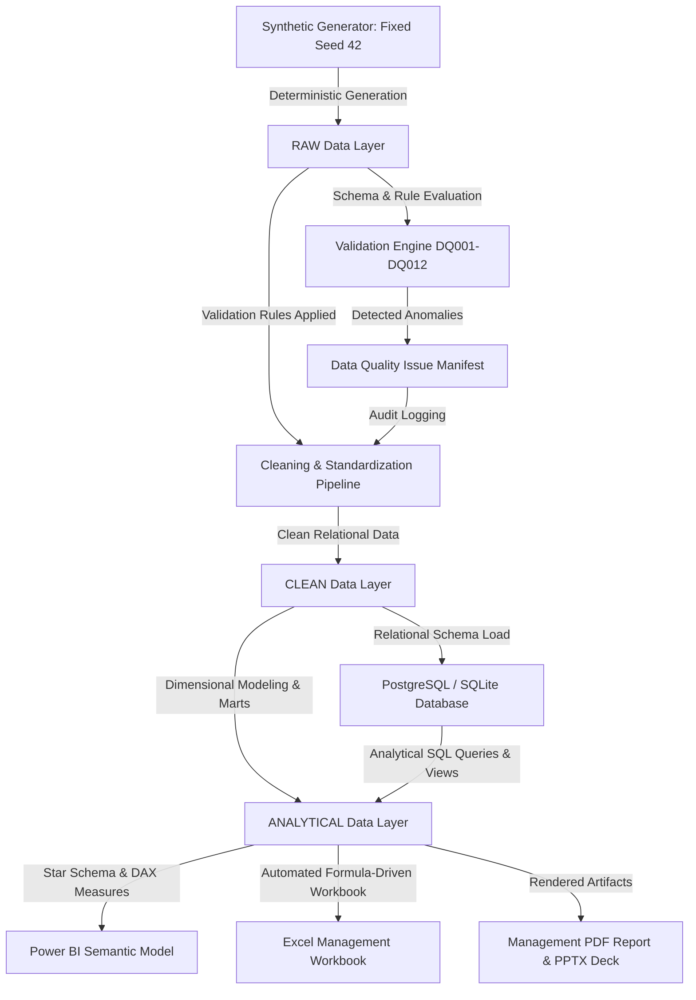

# Data Lineage Architecture & Flow

**Project:** Corporate Real Estate Portfolio & Workplace Analytics  
**Scope:** India & Asia-Pacific Operational Portfolio  
**Status:** Validated Pipeline Architecture  

---

## 1. Architectural Overview

The analytics pipeline transforms raw operational and sensor logs into reliable, validated, executive-grade corporate real estate insights. It enforces a strict separation between raw ingestion, rule-based validation, audited cleaning, relational modeling, and analytical consumption.

---

## 2. Pipeline Layers

### Layer 1: RAW (`data/raw/`)
- **Nature:** High-fidelity operational synthetic data reflecting raw outputs from Computerized Maintenance Management Systems (CMMS), badge access turnstiles, room scheduling systems, and enterprise lease administration databases.
- **Controlled Realism:** Explicitly contains realistic data flaws (spelling variations, inconsistent country mappings, inverted lease dates, negative costs, impossible utilization rates, unmapped room types).
- **Immutability:** The RAW layer is write-once and strictly immutable. No downstream process alters RAW files.

### Layer 2: Quality Detection & Issue Manifest (`data/quality_issue_manifest.csv`)
- **Nature:** An automated logging manifest capturing every detected anomaly during the validation pass before cleaning.
- **Attributes:** `issue_id`, `table_name`, `record_identifier`, `issue_type`, `expected_rule`, `injected_value`, `expected_correct_value`, `severity`.
- **Auditability:** Guarantees full traceability so that stakeholders can verify how each defect was flagged and handled.

### Layer 3: CLEAN (`data/clean/`)
- **Nature:** Relational files where every validated anomaly has been standardized, imputed via verified rules, or filtered out with an audit trail.
- **Transformations Applied:**
  - Case and whitespace standardization on geographic and facility fields.
  - Normalization of area units to square metres ($m^2$).
  - Enforcement of physical capacity constraints ($0 \le \text{ActualOccupants} \le \text{Capacity}$).
  - Correction of inverted lease dates based on lease term records.
  - Rectification of sign errors on financial transactions ($\text{Cost} \ge 0$).
  - Referential integrity verification between dimension and fact keys.

### Layer 4: ANALYTICAL (`data/analytical/`)
- **Nature:** Business-ready dimensional tables and aggregated analytical marts optimized for high-performance querying in SQL, Power BI, and Python.
- **Components:**
  - `dim_date`, `dim_geography`, `dim_property`, `dim_floor`, `dim_space`, `dim_facility_type`, `dim_lease`
  - `fact_daily_workplace_utilization`, `fact_monthly_property_cost`, `fact_room_utilization`, `fact_headcount`, `fact_data_quality`
  - Analytical aggregates: `mart_property_monthly_summary`, `mart_portfolio_attention_index`, `mart_workplace_pressure_matrix`.

### Layer 5: SQL Database Layer (`sql/`)
- **Nature:** Production-grade PostgreSQL / SQLite DDL schema with primary keys, foreign keys, check constraints, indexes, views, and complex analytical CTE queries.
- **Reconciliation Engine:** Executes independent analytical SQL scripts that reconcile identically against Python pandas transformations.

### Layer 6: Presentation & Reporting Layer (`powerbi/`, `excel/`, `reports/`, `presentation/`)
- **Power BI:** Star-schema semantic model with 6 focused pages, explicit DAX measure tables, drill-through property investigation sheets, and restrained professional visuals.
- **Excel:** Formula-driven management workbook (`Corporate_Real_Estate_Management_Workbook.xlsx`) containing dynamic summary cards, filters, and pivot tables.
- **PDF & PPTX:** Formally typeset executive management report (8–12 pages) and 7-slide strategic review deck.

---

## 3. Transformation Lineage Matrix

| Output Entity | Upstream Source(s) | Primary Transformation Key | Cleaning / Logic Applied | Downstream Consumer |
| :--- | :--- | :--- | :--- | :--- |
| `dim_property` | `raw_properties.csv`, `raw_leases.csv` | `PropertyKey` | Deduplicated keys, standardized metro naming, validated usable/rentable ratios | Power BI, SQL, Excel, PDF |
| `dim_space` | `raw_spaces.csv`, `raw_floors.csv` | `SpaceKey` | Category classification standardized, bookable flags normalized | SQL, Room Analysis, Floor Mart |
| `dim_lease` | `raw_leases.csv` | `LeaseKey` | Inverted date correction, expiry horizon bucketing relative to reporting date | Power BI Page 5, Excel Lease Tracker |
| `fact_daily_workplace_utilization` | `raw_utilization.csv` | `DateKey`, `SpaceKey` | Capped over-utilization errors (>100%), filtered weekend noise, calculated available hours | Utilization visuals, Pressure Matrix |
| `fact_monthly_property_cost` | `raw_property_costs.csv` | `MonthKey`, `PropertyKey` | Corrected negative sign costs, converted local currencies to reporting currency (INR) | Cost Analysis, Scatter Plot |
| `fact_data_quality` | `quality_issue_manifest.csv` | `IssueID` | Rule categorization (Completeness, Validity, Consistency, Referential) | Data Quality Dashboard (Page 6) |
| `mart_portfolio_attention_index` | `dim_property`, utilization facts, cost facts, lease dim, DQ fact | `PropertyKey` | Normalized min-max component scoring (30/20/20/15/15 weighting) | Executive Overview, Management Table |
