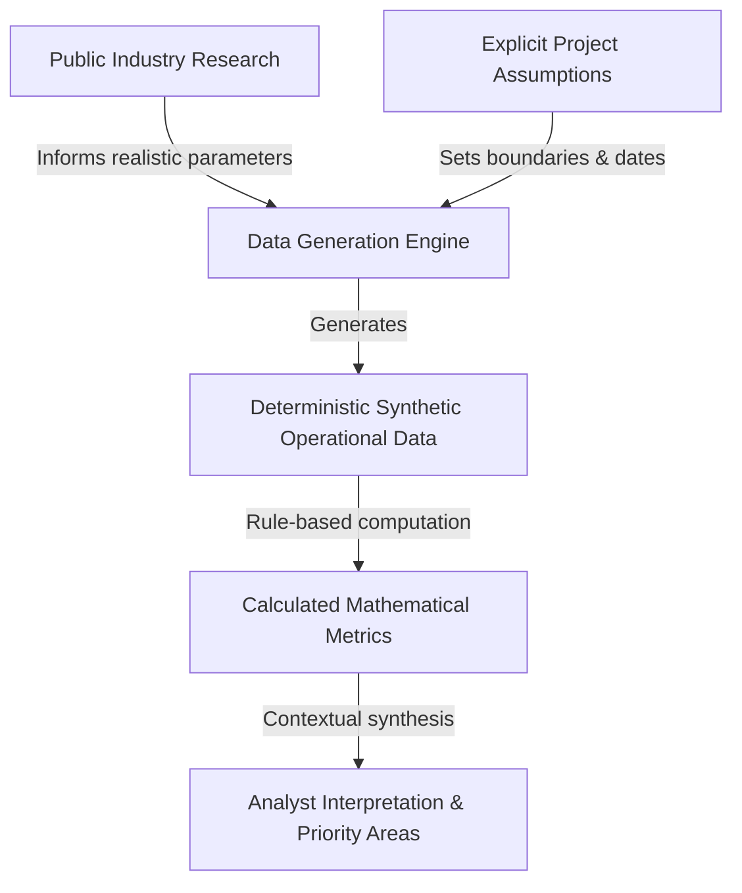

# Data Provenance & Ethics Disclosure

**Project:** Corporate Real Estate Portfolio & Workplace Analytics  
**Reporting Date:** 2026-09-30  
**Status:** Mandatory Disclosure  

---

## 1. Explicit Synthetic Data Statement

> **"The operational dataset used in this project is synthetic and created for analytical demonstration. It does not represent the actual property portfolio of any real organization."**

No real organization's confidential, proprietary, operational, or personally identifiable information has been used in this project. All property names, physical addresses, lease contracts, sensor logs, badge records, and financial accounting ledgers were generated programmatically using a deterministic pseudo-random process (fixed random seed = 42). Any resemblance to real commercial buildings, corporate lease contracts, or commercial tenancies is purely coincidental.

---

## 2. Taxonomy of Project Inputs

To maintain absolute academic and professional integrity, this project categorizes every information element into one of five distinct tiers:

### Tier 1: Public Industry Research
- **Definition:** Published, verifiable industry benchmarks, building standards, and market dynamics from recognized international professional bodies and commercial real estate research firms.
- **Sources Used:**
  - Building measurement standards: BOMA International (ANSI/BOMA Z65.1-2017)
  - Facility management principles: ISO 41001:2018, IFMA Global Benchmarks
  - Workplace utilization and hybrid dynamics: CoreNet Global, Cushman & Wakefield, Leesman Index
  - Market context and absorption patterns: CBRE Asia-Pacific and India Office Figures
- **Application:** Research guides the *boundaries of plausibility* (e.g., typical floor loss factors of 15–20%, workplace density of 8–12 m²/desk, mid-week utilization peaks of 65–85%, and room no-show rates of 20–35%).

### Tier 2: Project-Defined Assumptions
- **Definition:** Operational constants, reference dates, exchange rates, and business calendars defined to simulate an enterprise operating environment.
- **Key Parameters:**
  - **Fixed Reporting Date:** September 30, 2026.
  - **Reporting Currency:** Indian Rupee (INR - ₹).
  - **Reference Exchange Rates:** Fixed reference rates for cross-border cost translation (e.g., 1 SGD = 63.5 INR; 1 AUD = 55.2 INR; 1 USD = 83.5 INR; 1 MYR = 18.2 INR; 1 THB = 2.35 INR; 1 IDR = 0.0053 INR).
  - **Operational Working Hours:** 10 standard operating hours per business day (08:00 to 18:00), 5 days per week.

### Tier 3: Synthetic Operational Data
- **Definition:** The underlying records across the 25 fictional properties, 140 floors, 650 workplace zones, 24 months of daily utilization observations, room booking records, and monthly financial costs.
- **Generation Method:** Built deterministically via Python NumPy and Pandas pipelines using controlled statistical distributions (Beta, Log-normal, and Truncated Normal) to simulate authentic operational rhythms (day-of-week seasonality, office archetype behaviors, and capacity bottlenecks).
- **Quality Anomalies:** Intentionally injected data-hygiene errors logged in `data/quality_issue_manifest.csv` to exercise validation and data cleansing layers.

### Tier 4: Calculated Metrics
- **Definition:** Deterministic mathematical computations derived directly from the underlying clean data.
- **Examples:**
  - $\text{Average Utilization \%} = \frac{\sum \text{Occupied Hours}}{\sum \text{Available Hours}}$
  - $\text{Cost per Seat} = \frac{\text{Annual Operating Cost}}{\text{Seat Capacity}}$
  - $\text{Cost per Occupied Seat} = \frac{\text{Annual Operating Cost}}{\text{Average Daily Presence}}$
  - $\text{Capacity Pressure} = \frac{\text{Count of Days with Peak Utilization } \ge 85\%}{\text{Total Working Days}}$
  - **Portfolio Attention Index:** Weighted composite score ($0–100$) based on five transparent, normalized operational indicators.

### Tier 5: Analyst Interpretation & Strategic Context
- **Definition:** Structured analytical commentary, quadrant classification, and hypotheses developed to support management decision-making.
- **Guiding Rule:** Analyst findings follow the strict progression:
  $$\text{Observation} \longrightarrow \text{Evidence} \longrightarrow \text{Interpretation} \longrightarrow \text{Business Implication} \longrightarrow \text{Investigation Area}$$
  The analyst surfaces operational evidence and frames relevant business questions; strategic and operational decisions remain the prerogative of executive management.
